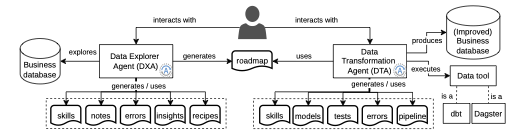
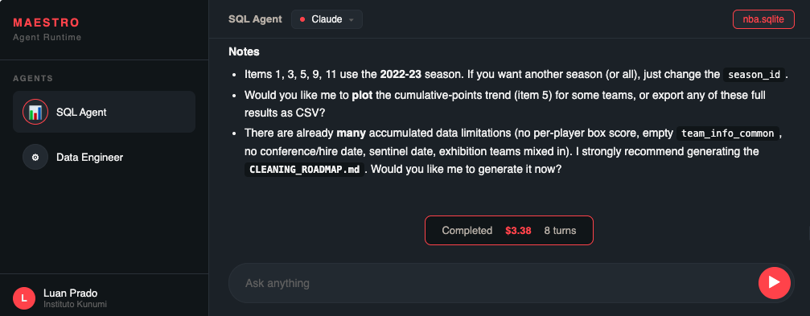
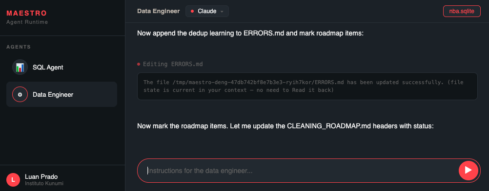

# Agentic Data Engineering

**Open source notice**
>
> This repository is publicly available as part of the materials
> presented at the **41st Brazilian Symposium on Databases (SBBD 2026)**. It has been made open source
> to support transparency, reproducibility, and community engagement
> around the work shared at the conference.
>
> Outside of this context, the code and resources contained here are
> provided as-is, without active maintenance or support guarantees.
> Contributions and feedback are welcome, but response times may vary.

**Citation**

If you using, comparing, or developing based on our architecture, please cite our work as follow. We also suggest you read our paper.

```
@inproceedings{pradoetal2026agenticdataengineering,
  title={Towards Agentic Data Engineering: A Contract-Driven System with Self-Evolving Knowledge},
  author={Luan Prado and Leonardo Guerreiro Azevedo and Adriano Veloso},
  booktitle={Brazilian Symposium on Databases},
  year={2026}
}
```

This repo presents details of the Agentic Data Engineering architecture proposed in the paper "Towards Agentic Data Engineering: A Contract-Driven System with Self-Evolving Knowledge" [1] and the [demonstration](./NBA/README.md) of the archicture used to improve the NBA database [2].

The agentic architecture comprises (Figure 1): 

- Data Explorer Agent (DXA): explores a business database, externalizes knowledge, and creates a roadmap; 
- Data Transformation Agent (DTA): uses the roadmap to improve the business database.




Figure 1. The Data Engineer Agentic Architecture.

DXA and DTA are implemented as agents (LLM that uses tools) with persistent, file-based memory. 
The user interacts with both agents in natural language via a prompt-based User Interface.
The interaction with DXA primarily involves answering business questions while exploring the database. 
The DXA may proactively reach out to the user whenever it encounters fields, business rules, or semantic ambiguities that require domain knowledge to proceed — such as clarifying the meaning of a column or confirming how a specific rule should be applied. 
Newly validated findings are written back into the knowledge base (KB).
Once the exploration is complete, DXA requests the user's approval before generating a roadmap, which is produced only upon explicit user consent. 
The roadmap items act as data contracts for DXA and DTA communication.
The roadmap is consumed by the DTA to create production-grade data pipelines.
DTA uses data tools to transform the business database into an improved version using pipelines.
The user interaction is optional during DTA execution.

We provide 31 examples of questions the user may ask when using DXA to explore the database at [./NBA/questions/questions_sql_nba.csv](./NBA/questions/questions_sql_nba.csv). The questions are categorized by difficulty level as easy, medium, or hard to be processed by the agent.

We provide examples of the user interacting with the agentic user interface (IU) at [./NBA/runs/dxa-run-1/dxa.html](./NBA/runs/dxa-run-1/dxa.html) (Figure 2) and at [./NBA/runs/dta-run-1/dta.html](./NBA/runs/dta-run-1/dta.html) (Figure 3).



Figure 2 - Example of DXA UI.



Figure 3 - Example of DTA UI.

## Data Explorer Agent (DXA)

The DXA supports analysts, domain experts, and data engineers during database exploration and requirement elicitation. The current implementation targets relational databases and relies on SQL queries plus standard DBMS metadata facilities.

During database exploration, DXA builds a persistent knowledge base (KB) composed of four Markdown files:

- NOTES.md: schema metadata, descriptive statistics, and business rules.
- ERRORS.md: syntactic, semantic, and logical issues.
- INSIGHTS.md: business-relevant findings.
- RECIPES.md: query templates validated through execution.
- SKILLS.md: instructions to perform causal analysis, to plot charts, graphs, or other kinds of visualization, and to execute data profiling.

Examples of DXA artifacts from the experiments conducted on the NBA database are available at [/NBA/artifacts/dxa](./NBA/artifacts/dxa-run-1/).

Once the business database exploration is complete, DXA produces a roadmap. Each roadmap item corresponds to a contract that specifies a data engineering issue validated by the DXA and to be resolved by the DTA. A contract is created only after a query that evidences the issue has been executed and validated. A roadmap example is presented [here](NBA/artifacts/dxa-run-1/CLEANING_ROADMAP.md). 

### ROADMAP

The roadmap (CLEANING_ROADMAP.md) contains a list of issues where each one acts as a contract containing:

- **Problem issue ID and description**: e.g., "CLEAN-001: Table team_info_common is completely empty";
- **Severity**: critical, warning, or info;
- **Artifact**: where the issue was found (e.g., a table `team_info_common`);
- **Problem**: Issue characterization (e.g., nulls, inconsistent types, denormalizations, ambiguous encodings);
- **Evidence**: Query that evidences the issue and summary of its execution results (e.g., number of query columns and returned rows, mixed data types in a column); and
- **Recommended action**: action to solve the issue (e.g., cast, impute, normalize, deduplicate, or remove).


An example of a roadmap contract is:

---

**CLEAN-001: Table `team_info_common` is empty.**
- **Table:** `team_info_common`
- **Severity:** critical
- **Problem:** The table exists with 26 columns but contains 0 rows. It cannot be used as a data source and may cause confusion in joins.
- **Evidence:**
```sql
SELECT COUNT(*) as total_rows FROM team_info_common;
-- Result: 0
```
- **Result:** 0 lines, 26 columns — Table 100% empty
- **Recommended action:** Check if the table should be populated (via ETL (Extract-Transform-Load)) or dropped. If it's a duplicate of the table `team_details`, consolidate them and drop the table `team_info_common`.
---

### NOTES

The `NOTES.md` file stores information about database metadata, like schema, relationships, business rules, and limitations. An example of NOTES.md is presented at [./NBA/artifacts/dxa-run-1/NOTES.md](./NBA/artifacts/dxa-run-1/NOTES.md), and examples of entries are:

- schema:
  - Name of the database tables, e.g., `game`, `game_summary`.
  - For each table
    - columns, e.g., `id (BIGINT, e.g., 1610612737)`, `full_name`, and `abbreviation`.
    - columns' types that are awkward, e.g., `team.year_founded` has a `FLOAT` datatype.
    - summary of the table, e.g., "table `team` corresponds to 30 teams, current (current NBA franchises)".
    - Gotchas, e.g., "`city` is sometimes a region, not a literal city (e.g., "Golden State", "Indiana", "Utah", "Minnesota")."
- Limitations, e.g.:
    - For "name+position+height", use `common_player_info` (it cannot be obtained from `player`).
    - **TEMPORAL LIMIT: data ranges from 1946-11-01 to 2023-06-12.** There are NO games after Jun/2023 (e.g, Jan/2025 returns 0). Historical snapshot ending at the 2022-23 season.
- Business rules, e.g.:
    - "Pivô"=Center and INCLUDES hybrids (Forward-Center, Center-Forward) → `position LIKE '%Center%'`. Translations: Armador=Guard, Ala=Forward, Pivô=Center.

### ERRORS

Log of errors (syntactic and business) with post-mortem, i.e., the agent records the social and technical context of the error for diagnostic purposes. An example of ERRORS.md is presented at [./NBA/artifacts/dxa-run-1/ERRORS.md](./NBA/artifacts/dxa-run-1/ERRORS.md), and an example of one of its entries is:

---
**ERR-001: CAST fails on empty strings in common_player_info**
- Type: syntactic
- Query: `AVG(CAST(weight AS DOUBLE))` and `CAST(SPLIT_PART(height,'-',1) AS INT)`
- Error: `Could not convert string '' to DOUBLE/INT32`. weight/height have '' (empty) values.
- Detail: `AVG(... ) FILTER (WHERE ...)` does NOT avoid the error — the CAST is evaluated on all rows before the FILTER.
- Fix: use **TRY_CAST** (returns NULL instead of an error). E.g.: `AVG(TRY_CAST(weight AS DOUBLE))`,
  `TRY_CAST(SPLIT_PART(height,'-',1) AS INT)`.
- Post-mortem: ALWAYS use TRY_CAST when converting text columns in common_player_info (weight, height, etc.) — there are empty strings.
---

### INSIGHTS

Business findings confirmed by the user. It is only generated when the user interacts with the system and confirms that the insight found should be registered in the Knowledge Base.

### RECIPES

SQL templates validated by the agent. An example of  RECIPES.md file is [./NBA/artifacts/dxa-run-1/RECIPES.md](./NBA/artifacts/dxa-run-1/RECIPES.md) and one example of template is:

---
**RCP-003: Convert height "feet-inches" to meters and filter**
- Context: `common_player_info.height` is text like "7-2". Conversion: (feet*12 + inches)*0.0254 m.
- Query:
  ```sql
  WITH h AS (
    SELECT display_first_last AS nome, position AS posicao, height AS altura_ft,
           (CAST(SPLIT_PART(height,'-',1) AS INT)*12 + CAST(SPLIT_PART(height,'-',2) AS INT)) * 0.0254 AS altura_m
    FROM [CPI_TABLE]
    WHERE height IS NOT NULL AND height LIKE '%-%'
  )
  SELECT nome, posicao, altura_ft, ROUND(altura_m,3) AS altura_m
  FROM h WHERE altura_m > [LIMITE_M] ORDER BY altura_m DESC, nome
  ```
- Tested on: common_player_info (2026-06-17) → 986 players above 2.05 m.
- Combines with: RCP-002.
- Note: 2.05 m ≈ 80.7 in → includes 6-9 (2.057 m) and above.
---

### SKILLS

Currently, we define three skill types for the agent. They are used when the user interacts with the UI and asks for something.

- Causal Analysis: a set of endpoints that the agent may invoke to execute an analysis of a metric value. 
- Plot: When the user asks for a chart, graph, or visualization.
- Data Profiling: Structural pattern discovery powered by [Desbordante](https://github.com/Desbordante/desbordante-core).

An example of SKILLS.md is [./NBA/artifacts/dxa-run-1/SKILLS.md](./NBA/artifacts/dxa-run-1/SKILLS.md).


## Data Transformation Agent (DTA)

The DTA receives the roadmap and implements each contract as a data pipeline; i.e., it translates the contracts into models, tests, and orchestration assets to transform the business database. In the current implementation, the DTA produces dbt1 models for transformation and uses Dagster for orchestration.

Examples of DTA artifacts from experiments conducted on the NBA database are available at [/NBA/artifacts/dta](./NBA/artifacts/dta-run-1/).

dbt expresses transformations declaratively as SQL SELECT statements, while handling testing, documentation, lineage, and versioning. Dagster complements this by orchestrating asset execution, inferring dependencies, attaching observability metadata, and managing scheduling and recovery. Together, they enable DTA to translate validated specifications into executable, monitorable pipelines.

The DTA maintains its own KB, composed of:

- ROADMAP.md: the contracts received from DXA;
- MODELS.md: the created dbt models;
- TESTS.md: tests and results;
- PIPELINE.md: assets, dependencies, and schedules;
- ERRORS.md: transformation-time failures and workarounds;
- SKILLS.md: command references for dbt and Dagster.

In the first session, DTA initializes the dbt project, configures the target database, and processes the roadmap contracts sequentially. Then, DTA follows an execution loop. For each contract, it reads the specification, writes the corresponding model and tests, executes them, and either registers success or records the failure and its workaround. Once the full pipeline succeeds, DTA generates Dagster assets, runs the workflow, updates PIPELINE.md, and commits changes to Git for version control. Failures are also
recorded, generalized, and made available for reuse in later contracts and future sessions.

Examples of DTA artifacts from experiments conducted on the NBA database are available at [/NBA/artifacts/dta](./NBA/artifacts/dta-run-1/). The roadmap entries are explained in the [DXA section](#roadmap).

### MODELS

dbt models created by the DTA to transform the database considering, the staging, intermediate, and mart conceptual layers:

- Staging: ingestion, cleaning, and standardization of raw data in a one-to-one relationship with the source; 
- Intermediate: an isolated transition layer for data joins and the application of complex business logic; and 
- Mart: the final presentation layer, structured dimensionally or denormalized, and optimized for analytical consumption

Each dbt model has:

- id: e.g., `MOD-001`.
- name: e.g., `stg_nba__teams`.
- layer: e.g., staging.
- source: e.g., the table `nba.team`.
- materialization type: e.g., `view`.
- tests to be executed: e.g., `not_null+unique(team_id)`, `not_null(team_full_name)`.
- the roadmap contracts from which the model was created: `CLEAN-004`, `CLEAN-009`.
- status of its execution: e.g., `✅ green`, `✅ green (gap documented)`, `⚠️ warn`.

Examples of models are presented at [./NBA/artifacts/dta-run-1/MODELS.md](./NBA/artifacts/dta-run-1/MODELS.md), and example is:

---
**MOD-001: stg_nba__teams**

- Layer: staging | Source: nba.team | Materialization: view
- Tests: not_null+unique(team_id), not_null(team_full_name)
- Roadmap: CLEAN-004, CLEAN-009 | Status: ✅ green | Created: 2026-06-17
---


### TESTS

Test results and coverage of dbt test runs, presented as summaries by layer, custom tests, warnings, and verified business outcomes. An example is presented at [](./NBA/artifacts/dta-run-1/TESTS.md).

### PIPELINE

The pipeline contains the data required to execute the database transformation, such as:

- source and target databases
- dbt profiles
- inventory: summary about the execution
- dependency graph about the dbt models and source tables.
- dagster orchestration
- run commands

An example of a pipeline is presented at [./NBA/artifacts/dta-run-1/PIPELINE.md](./NBA/artifacts/dta-run-1/PIPELINE.md).

### ERRORS

Log of errors (syntactic and business) with post-mortem, i.e., the agent records the social and technical context of the error for diagnostic purposes. An example of ERRORS.md is presented at [./NBA/artifacts/dta-run-1/ERRORS.md](./NBA/artifacts/dta-run-1/ERRORS.md).

### SKILLS

Command references for dbt, DuckDB, Spark, and Dagster. An example of SKILLS.md is presented at [./NBA/artifacts/dta-run-1/SKILLS.md](./NBA/artifacts/dta-run-1/SKILLS.md).

## References

[1] Silva, L. P., Azevedo, L. G., Veloso, A. "Towards Agentic Data Engineering: A Contract-Driven System with Self-Evolving Knowledge". In: 41o Brazilian Symposium in Databases (SBBD 2026), São Carlos, SP, Brazil. (To be published)

[2] Walsh, W. (2026). NBA database. Version 3.1. Available at: https://www.kaggle.com/datasets/wyattowalsh/basketball. URL date: June 15th, 2026.
